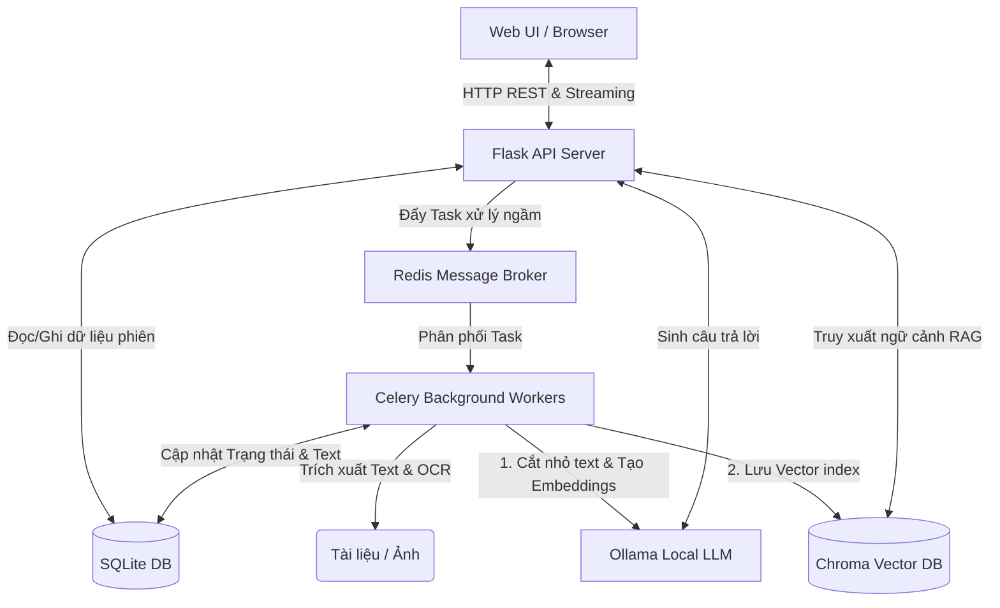
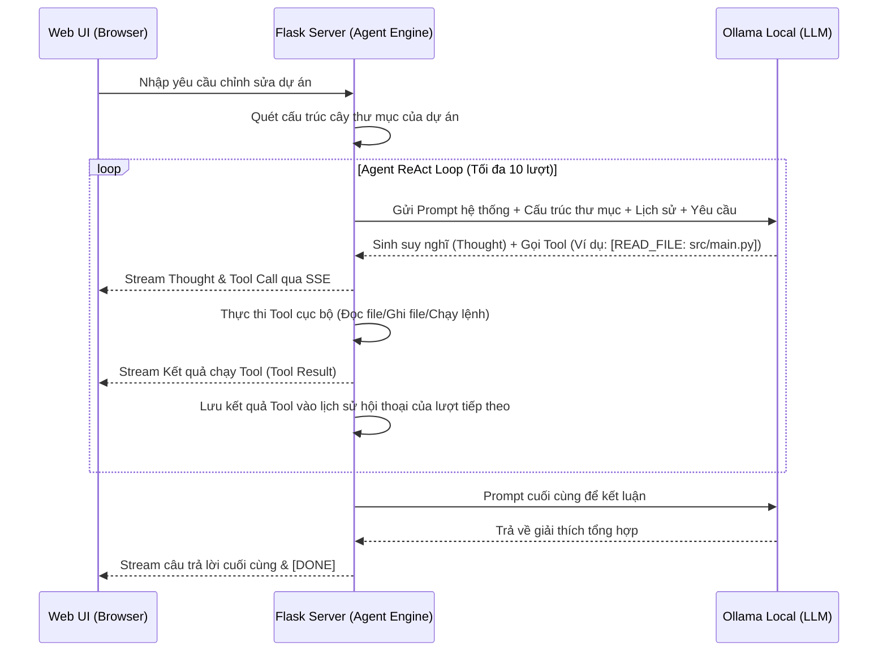

# Tài liệu Kiến trúc Hệ thống (System Architecture)

Dự án này đã được nâng cấp từ một cấu trúc đồng bộ đơn giản (In-memory, single-threaded) lên một kiến trúc **Bất đồng bộ (Asynchronous Background Worker)** kết hợp với **RAG (Retrieval-Augmented Generation) cục bộ**.

Dưới đây là mô tả chi tiết về mặt kiến trúc, cơ sở dữ liệu và luồng đi của dữ liệu trong hệ thống mới.

---

## 🌟 Ưu điểm nổi bật của Kiến trúc mới (Key Advantages)

Kiến trúc này mang lại các cải tiến vượt trội so với phiên bản đồng bộ (in-memory) cũ:

1.  **Không bị nghẽn giao diện (Non-blocking UI & API):** 
    Tác vụ nặng như trích xuất text PDF/Word dài và xử lý nhận diện hình ảnh (OCR) được đẩy hoàn toàn sang Celery chạy ngầm. Flask API phản hồi ngay lập tức cho client trong vòng dưới `50ms`, loại bỏ hoàn toàn hiện tượng đơ trình duyệt và tránh lỗi **HTTP Timeout (504)** khi tải file lớn.
2.  **Khóa bỏ giới hạn độ dài tài liệu (Virtually Unlimited Document Size):**
    Thay vì giới hạn cắt xén tài liệu ở mức `15,000 ký tự` để vừa khít context window của LLM, **RAG** cho phép người dùng tải lên tài liệu hàng trăm trang. Dữ liệu được cắt nhỏ và tìm kiếm thông minh từ **ChromaDB**.
3.  **Tăng tốc độ trả lời của AI local (Fast LLM Response Time):**
    LLM local (chạy trên CPU/GPU cá nhân) không cần phải nạp lại và xử lý toàn bộ tài liệu khổng lồ cho mỗi câu hỏi (Prefill phase). RAG chỉ gửi kèm **Top-4 đoạn liên quan nhất** (~2,000 ký tự) giúp tốc độ AI sinh chữ đầu tiên (Time-To-First-Token) **nhanh gấp 5 đến 10 lần** (chỉ mất 2-5 giây thay vì 30s-1 phút).
4.  **Lưu trữ bền vững (Persistent Session Storage):**
    Toàn bộ lịch sử hội thoại và thông tin tệp tin được lưu trong cơ sở dữ liệu SQLite (`ai_local_support.db`) thay vì RAM. Khởi động lại Flask app hoặc Celery worker không làm mất dữ liệu trò chuyện của người dùng.
5.  **Dễ dàng mở rộng cấu hình (Scalability):**
    Chúng ta có thể dễ dàng tăng số lượng Celery workers chạy song song để tận dụng tối đa tài nguyên đa nhân của CPU/GPU khi xử lý đồng thời nhiều tệp tài liệu lớn từ nhiều người dùng.

---

## 🏷️ Tên gọi Kiến trúc và Các Pattern áp dụng (Architecture & Design Patterns)

Hệ thống được thiết kế và vận hành dựa trên các mô hình kiến trúc và design patterns chuẩn sau:

1.  **Kiến trúc RAG cục bộ (Local Retrieval-Augmented Generation):**
    *   *Mô tả:* Kiến trúc sinh văn bản tăng cường truy xuất dữ liệu cục bộ.
    *   *Áp dụng:* Văn bản được phân mảnh (chunking), tính toán vector nhúng bằng model `nomic-embed-text` và lưu trữ tại ChromaDB. Khi người dùng hỏi, hệ thống truy xuất các đoạn ngữ cảnh phù hợp nhất để làm đầu vào cho LLM trả lời, giúp tránh giới hạn cửa sổ ngữ cảnh và tăng độ chính xác.
2.  **Mô hình Task Queue / Background Worker (Broker-Worker Pattern):**
    *   *Mô tả:* Mô hình xử lý bất đồng bộ qua hàng đợi thông điệp để thực hiện các tác vụ nặng mà không gây nghẽn tiến trình chính.
    *   *Áp dụng:* API Web đóng vai trò là **Producer** đẩy các yêu cầu xử lý tài liệu vào **Redis** (đóng vai trò **Message Broker**). [Celery Workers](file:///Users/nguyenson/Github/ai-local-support/tasks.py) đóng vai trò **Consumer / Worker** liên tục lắng nghe và xử lý ngầm (đọc file, OCR, sinh embeddings), đảm bảo API phản hồi cho giao diện dưới `50ms` (Non-blocking UI).
3.  **Kiến trúc Phân rã (Decoupled / Event-Driven Architecture):**
    *   *Mô tả:* Phân tách độc lập các khối tính toán và giao tiếp gián tiếp qua cơ sở dữ liệu và message queue.
    *   *Áp dụng:* Tách biệt luồng xử lý tương tác trực tiếp với người dùng (Flask) và luồng xử lý hậu trường nặng (Celery). Đồng bộ trạng thái hội thoại và trạng thái tệp tin thông qua SQLite Database (`ai_local_support.db`) và Redis Broker.
4.  **Application Factory Pattern (Flask):**
    *   *Mô tả:* Tránh việc khai báo ứng dụng Flask trực tiếp toàn cục để ngăn chặn việc import vòng (circular imports).
    *   *Áp dụng:* Tạo tệp [app_factory.py](file:///Users/nguyenson/Github/ai-local-support/app_factory.py) chứa hàm `create_app()`. Blueprints được đăng ký động bên trong hàm này giúp tách biệt cấu trúc dự án.
5.  **Repository Pattern (Database Abstraction):**
    *   *Mô tả:* Tách biệt hoàn toàn tầng logic nghiệp vụ với tầng truy cập cơ sở dữ liệu.
    *   *Áp dụng:* Toàn bộ các câu truy vấn SQLAlchemy/SQLite được đóng gói thành các class trong [repositories.py](file:///Users/nguyenson/Github/ai-local-support/services/repositories.py), giúp Blueprints và Services không cần truy vấn trực tiếp model hoặc gọi `db.session.commit()`.
6.  **Strategy & Factory Pattern (Document Extraction):**
    *   *Mô tả:* Định nghĩa một họ thuật toán trích xuất tệp, đóng gói từng thuật toán lại và giúp chúng có thể thay thế lẫn nhau.
    *   *Áp dụng:* Trong [extractor_service.py](file:///Users/nguyenson/Github/ai-local-support/services/extractor_service.py), các class trích xuất kế thừa `BaseExtractor` (PDF, Word, TXT, OCR) và được chọn tự động qua `ExtractorFactory` dựa trên phần mở rộng tệp tin.
7.  **Command Pattern (Agent Tools Registry):**
    *   *Mô tả:* Đóng gói yêu cầu thực thi công cụ thành một đối tượng độc lập, cho phép tham số hóa các yêu cầu.
    *   *Áp dụng:* Các công cụ của Coding Agent (đọc file, ghi file, quét thư mục...) được định nghĩa thành các class kế thừa `BaseAgentTool` trong [agent_tool_service.py](file:///Users/nguyenson/Github/ai-local-support/services/agent_tool_service.py) và được gọi thống nhất qua `ToolRegistry`.

---

## 🗺️ Sơ đồ Kiến trúc Tổng quan (Architecture Diagram)

Hệ thống hoạt động dựa trên các thành phần biệt lập, kết nối với nhau qua cơ sở dữ liệu và hàng đợi tin nhắn:



---

## 📦 Các thành phần chính trong Hệ thống

1.  **Flask API Application ([app_factory.py](file:///Users/nguyenson/Github/ai-local-support/app_factory.py)):**
    *   Được xây dựng theo mẫu **Application Factory**. Khởi tạo Flask Web Server, cấu hình cơ sở dữ liệu, logging, và đăng ký Blueprints một cách động.
    *   Tránh các lỗi import chéo lúc khởi tạo.
2.  **Celery Workers ([tasks.py](file:///Users/nguyenson/Github/ai-local-support/tasks.py)):**
    *   Là các luồng xử lý chạy hoàn toàn độc lập với Flask.
    *   Thực hiện các tác vụ nặng: Trích xuất nội dung văn bản thông qua Extractor Service, chạy OCR, tạo chunks văn bản, sinh vector nhúng và nạp vào ChromaDB.
3.  **Tầng Cấu trúc Dữ liệu & Repository ([repositories.py](file:///Users/nguyenson/Github/ai-local-support/services/repositories.py)):**
    *   Đóng gói toàn bộ các thao tác đọc/ghi cơ sở dữ liệu (SQLite).
    *   Giúp các controller (blueprints) và services độc lập hoàn toàn với việc quản lý SQLAlchemy session và truy vấn SQL thuần.
4.  **Tầng Nghiệp vụ (Services Layer):**
    *   [extractor_service.py](file:///Users/nguyenson/Github/ai-local-support/services/extractor_service.py): Trích xuất văn bản độc lập (Strategy & Factory).
    *   [agent_service.py](file:///Users/nguyenson/Github/ai-local-support/services/agent_service.py): Vận hành ReAct Coding Agent Loop.
    *   [agent_tool_service.py](file:///Users/nguyenson/Github/ai-local-support/services/agent_tool_service.py): Đóng gói lệnh công cụ (Command Pattern).
    *   [helper_service.py](file:///Users/nguyenson/Github/ai-local-support/services/helper_service.py): Các helper SSE, chat history, ngôn ngữ.
5.  **Redis Message Broker:**
    *   Là trạm trung chuyển tin nhắn trung gian. Flask gửi yêu cầu "xử lý file" vào Redis, Celery Workers liên tục lắng nghe Redis để kéo task về xử lý khi rảnh.
6.  **SQLite Database (`ai_local_support.db`):**
    *   Cơ sở dữ liệu lưu trữ quan hệ để lưu giữ thông tin phiên làm việc ([models.py](file:///Users/nguyenson/Github/ai-local-support/services/models.py)) giúp chia sẻ trạng thái chung giữa Flask và Celery.
7.  **ChromaDB Vector Database (`./chroma_db`):**
    *   Cơ sở dữ liệu Vector cục bộ dạng nhúng (embedded).
    *   Lưu trữ các đoạn tài liệu được cắt nhỏ kèm Vector 768 chiều được tính toán từ model `nomic-embed-text` của Ollama.
8.  **Ollama (AI Local Runner):**
    *   Cung cấp API để chạy cục bộ các model LLM (`qwen2.5-coder`, `deepseek-r1`, `qwen2.5-vl`...) và Embedding Model (`nomic-embed-text`).

---

## 🔄 Luồng dữ liệu (Data Lifecycle)

### A. Luồng Upload & Phân tích tài liệu (Background Ingestion)

1.  Người dùng tải lên một tài liệu (ví dụ: `document.pdf`) từ giao diện Web.
2.  **Flask** nhận yêu cầu:
    *   Lưu file vào thư mục `uploads/`.
    *   Tạo bản ghi trong bảng `document_sessions` với trạng thái `status = 'processing'`.
    *   Gọi `process_document_task.delay(session_id, filepath, ...)` gửi sang **Redis**.
    *   Trả về phản hồi `"status": "processing"` ngay lập tức cho client. Giao diện UI chuyển sang màn hình chờ.
3.  **Celery Worker** nhận Task từ Redis:
    *   Đọc và trích xuất toàn bộ văn bản của tài liệu.
    *   Nếu là ảnh và model chat không hỗ trợ Vision, chạy Tesseract OCR để lấy chữ.
    *   Sử dụng `RecursiveCharacterTextSplitter` chia văn bản thành các đoạn (chunks) dài 1000 ký tự (trùng lặp 200 ký tự).
    *   Gọi Ollama sinh vector embeddings cho từng chunk và lưu vào Collection `sess_<session_id>` của **ChromaDB**.
    *   Cập nhật cơ sở dữ liệu `document_sessions`: set `status = 'ready'`.
4.  **Client UI** liên tục gửi yêu cầu thăm dò (polling) API `/api/doc/status/<session_id>` mỗi 2 giây. Khi nhận được trạng thái `'ready'`, giao diện sẽ mở khóa khung chat và hiển thị lời chào.

### B. Luồng Chat với Tài liệu (RAG - Retrieval-Augmented Generation)

1.  Người dùng gửi câu hỏi: *"Hạn thanh toán của hợp đồng này là ngày bao nhiêu?"*
2.  **Flask API** nhận câu hỏi:
    *   Gọi Ollama lấy vector embedding của câu hỏi bằng model `nomic-embed-text`.
    *   Gửi vector câu hỏi truy vấn vào **ChromaDB** của phiên đó để lấy ra **Top-4 đoạn văn bản liên quan nhất**.
    *   Gộp 4 đoạn văn bản này lại làm **Context** (ngữ cảnh).
3.  **Flask** gửi câu hỏi + Ngữ cảnh vào Prompt gửi tới LLM chat:
    ```
    Bạn là một trợ lý phân tích tài liệu. Hãy trả lời câu hỏi của người dùng CHỈ dựa trên ngữ cảnh dưới đây.
    Ngữ cảnh: [4 đoạn văn bản trích xuất từ ChromaDB]
    Câu hỏi: [Câu hỏi của người dùng]
    ```
4.  **Ollama** sinh câu trả lời dựa trên đúng ngữ cảnh đó và stream từng chữ về giao diện WebUI theo thời gian thực.

---

## 💾 Cấu trúc Cơ sở dữ liệu (SQLite Schema)

Hệ thống sử dụng SQLAlchemy để định nghĩa 3 bảng trong SQLite ([models.py](file:///Users/nguyenson/Github/ai-local-support/services/models.py)):

### 1. Bảng `document_sessions`
Lưu trữ trạng thái và cấu hình của các tệp tài liệu được upload:
*   `session_id` (String - Khóa chính): UUID định danh phiên làm việc.
*   `filename` (String): Tên tệp gốc.
*   `filepath` (String): Đường dẫn tệp vật lý trên ổ đĩa.
*   `status` (String): Trạng thái xử lý (`processing`, `ready`, `failed`).
*   `language` (String): Ngôn ngữ phản hồi của AI (`en`/`vi`).
*   `model` (String): Tên model LLM được chọn để chat.
*   `file_type` (String): Phân loại tệp (`document`/`image`).
*   `base64_image` (Text - Tùy chọn): Ảnh đã nén (dành riêng cho Vision Model).
*   `extracted_text` (Text - Tùy chọn): Toàn bộ text đã trích xuất từ file (dùng để preview).

### 2. Bảng `code_sessions`
Lưu trữ thông tin về đoạn mã được paste vào để phân tích:
*   `session_id` (String - Khóa chính): UUID định danh phiên làm việc.
*   `code` (Text): Toàn bộ mã nguồn do người dùng paste vào.
*   `language` (String): Ngôn ngữ lập trình được chọn.
*   `model` (String): Tên model LLM được chọn để phân tích.
*   `ui_language` (String): Ngôn ngữ giao diện.

### 3. Bảng `chat_messages`
Lưu trữ lịch sử hội thoại của cả phần Phân tích Tài liệu và Phân tích Code:
*   `id` (Integer - Khóa chính tự tăng)
*   `session_id` (String - Chỉ mục): Liên kết với `session_id` của tài liệu hoặc mã nguồn.
*   `role` (String): Vai trò gửi tin nhắn (`system`, `user`, `assistant`).
*   `content` (Text): Nội dung tin nhắn.
*   `created_at` (DateTime): Thời gian gửi tin nhắn.

---

## 🤖 Kiến trúc AI Coding Agent (ReAct Engine)

Trong Tab **Dự án (Project Workspace)**, hệ thống áp dụng mô hình **ReAct (Reasoning and Action)** cho phép AI hoạt động như một Kỹ sư phần mềm thực thụ. Thay vì yêu cầu người dùng tự chọn file và đính kèm context thủ công, Agent sẽ tự động lập kế hoạch và thực thi qua các công cụ (tools) được tích hợp trực tiếp.

### Luồng Hoạt Động (Agent Execution Loop)



### Các Công Cụ (Tools) Của Agent:
1.  **READ_FILE (`[READ_FILE: <path>]`):** Đọc nội dung tập tin chỉ định.
2.  **WRITE_FILE (`[WRITE_FILE: <path>]`):** Ghi đè hoặc tạo mới tập tin với nội dung tương ứng.
3.  **LIST_DIR (`[LIST_DIR: <path>]`):** Liệt kê thư mục hiện tại hoặc thư mục con.
4.  **SEARCH_FILES (`[SEARCH_FILES: <query>]`):** Tìm kiếm chuỗi/regex trong tên file hoặc nội dung file.
5.  **RUN_COMMAND (`[RUN_COMMAND: <command>]`):** Thực thi câu lệnh shell (như chạy unittest, lint, git diff) trong thư mục dự án và lấy ra stdout/stderr.
6.  **FINISH (`[FINISH]`):** Dừng vòng lặp và kết luận.

---

## 🔒 Bảo mật & Hiệu năng (Security & Performance Details)

1.  **Chống Path Traversal (Path Traversal Protection):**
    *   Hệ thống triển khai hàm `safe_join_project_path` kiểm tra và phân giải đường dẫn tương đối dựa trên đường dẫn tuyệt đối của thư mục làm việc.
    *   Mọi tệp tin trước khi đọc/ghi bởi Agent hoặc Client đều phải đi qua kiểm tra tiền tố đường dẫn, nếu Agent cố gắng truy cập ra ngoài phạm vi thư mục được cấu hình (ví dụ: bằng cách sử dụng `..` hoặc đường dẫn tuyệt đối khác hệ thống), hệ thống sẽ từ chối thực thi và trả về thông báo lỗi an toàn.
2.  **Bộ nhớ Cache danh sách Models (TTL Caching):**
    *   REST API tags của Ollama được lưu trong bộ nhớ cache TTL với vòng đời 60 giây.
    *   Giúp giảm thiểu tối đa các kết nối HTTP dư thừa đến Ollama runner cục bộ, tăng tốc độ phản hồi danh sách models khi chuyển đổi giao diện hoặc tải lại trang.
3.  **Hệ thống Logging đồng bộ (Unified Logging):**
    *   Được cấu hình tập trung tại `app_factory.py` sử dụng thư viện `logging` tiêu chuẩn của Python.
    *   Logs có định dạng thống nhất bao gồm timestamp rõ ràng, cấp độ ghi log (INFO/ERROR), tên tệp tin và số dòng phát sinh, giúp dễ dàng debug chẩn đoán lỗi trong cả Flask và Celery.


