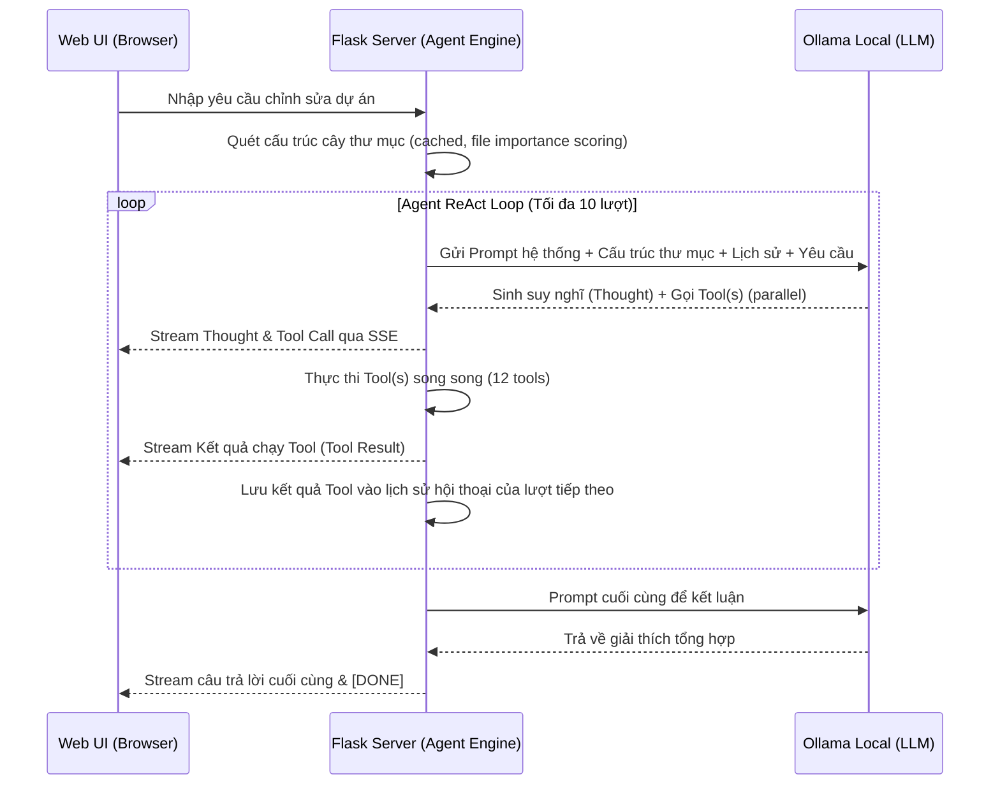

# Tài liệu Kiến trúc Hệ thống (System Architecture)

Dự án này đã được nâng cấp từ một cấu trúc đồng bộ đơn giản (In-memory, single-threaded) lên một kiến trúc **Bất đồng bộ (Asynchronous Background Worker)** kết hợp với **Hybrid RAG (Retrieval-Augmented Generation)** cục bộ.

Dưới đây là mô tả chi tiết về mặt kiến trúc, cấu trúc thư mục, APIs, cơ sở dữ liệu và luồng đi của dữ liệu trong hệ thống mới.

---

## 🌟 Ưu điểm nổi bật của Kiến trúc mới (Key Advantages)

Kiến trúc này mang lại các cải tiến vượt trội so với phiên bản đồng bộ (in-memory) cũ:

1. **Không bị nghẽn giao diện (Non-blocking UI & API):**
   Tác vụ nặng như trích xuất text PDF/Word dài và xử lý nhận diện hình ảnh (OCR) được đẩy hoàn toàn sang Celery chạy ngầm. Flask API phản hồi ngay lập tức cho client trong vòng dưới `50ms`, loại bỏ hoàn toàn hiện tượng đơ trình duyệt và tránh lỗi **HTTP Timeout (504)** khi tải file lớn.

2. **Khóa bỏ giới hạn độ dài tài liệu (Virtually Unlimited Document Size):**
   Thay vì giới hạn cắt xén tài liệu ở mức `15,000 ký tự` để vừa khít context window của LLM, **Hybrid RAG** cho phép người dùng tải lên tài liệu hàng trăm trang. Dữ liệu được cắt nhỏ (code-aware chunking) và tìm kiếm thông minh từ **ChromaDB** kết hợp keyword BM25 search.

3. **Tăng tốc độ trả lời của AI local (Fast LLM Response Time):**
   LLM local (chạy trên CPU/GPU cá nhân) không cần phải nạp lại và xử lý toàn bộ tài liệu khổng lồ cho mỗi câu hỏi (Prefill phase). Hybrid RAG chỉ gửi kèm **Top-6 đoạn liên quan nhất** (~3,000 ký tự) được chọn bằng Reciprocal Rank Fusion, giúp tốc độ AI sinh chữ đầu tiên (Time-To-First-Token) **nhanh gấp 5 đến 10 lần**.

4. **Lưu trữ bền vững (Persistent Session Storage):**
   Toàn bộ lịch sử hội thoại và thông tin tệp tin được lưu trong cơ sở dữ liệu SQLite (`ai_local_support.db`) thay vì RAM. Khởi động lại Flask app hoặc Celery worker không làm mất dữ liệu trò chuyện của người dùng.

5. **Dễ dàng mở rộng cấu hình (Scalability):**
   Celery worker được cấu hình với **solo pool** (tránh xung đột `fork()` trên Python 3.14+ với native extensions). Có thể chạy nhiều worker instances song song nếu cần xử lý đồng thời nhiều tệp từ nhiều người dùng.

---

## 🏷️ Tên gọi Kiến trúc và Các Pattern áp dụng (Architecture & Design Patterns)

Hệ thống được thiết kế và vận hành dựa trên các mô hình kiến trúc và design patterns chuẩn sau:

1. **Kiến trúc Hybrid RAG cục bộ (Local Hybrid Retrieval-Augmented Generation):**
   - *Mô tả:* Kiến trúc sinh văn bản tăng cường truy xuất dữ liệu cục bộ kết hợp 2 phương pháp tìm kiếm.
   - *Áp dụng:* Văn bản được phân mảnh (**code-aware chunking** tự động nhận diện function/class boundaries), tính toán vector nhúng bằng thư viện `fastembed` chạy trên CPU thông qua mô hình `nomic-ai/nomic-embed-text-v1.5-Q` và lưu trữ tại ChromaDB. Khi người dùng hỏi, hệ thống thực hiện **3-phase retrieval**: (1) Vector similarity search, (2) BM25-inspired keyword search, (3) **Reciprocal Rank Fusion (RRF)** kết hợp 60% vector + 40% keyword score. Kết quả top-6 chunks liên quan nhất được gửi cho LLM trả lời.

2. **Mô hình Task Queue / Background Worker (Broker-Worker Pattern):**
   - *Mô tả:* Mô hình xử lý bất đồng bộ qua hàng đợi thông điệp để thực hiện các tác vụ nặng mà không gây nghẽn tiến trình chính.
   - *Áp dụng:* API Web đóng vai trò là **Producer** đẩy các yêu cầu xử lý tài liệu vào **Redis** (đóng vai trò **Message Broker**). [tasks.py](tasks.py) đóng vai trò **Consumer / Worker** liên tục lắng nghe và xử lý ngầm (đọc file, OCR, sinh embeddings), đảm bảo API phản hồi cho giao diện dưới `50ms` (Non-blocking UI).

3. **Kiến trúc Phân rã (Decoupled / Event-Driven Architecture):**
   - *Mô tả:* Phân tách độc lập các khối tính toán và giao tiếp gián tiếp qua cơ sở dữ liệu và message queue.
   - *Áp dụng:* Tách biệt luồng xử lý tương tác trực tiếp với người dùng (Flask) và luồng xử lý hậu trường nặng (Celery). Đồng bộ trạng thái hội thoại và trạng thái tệp tin thông qua SQLite Database (`ai_local_support.db`) và Redis Broker.

4. **Application Factory Pattern (Flask):**
   - *Mô tả:* Tránh việc khai báo ứng dụng Flask trực tiếp toàn cục để ngăn chặn việc import vòng (circular imports).
   - *Áp dụng:* Tạo tệp [app_factory.py](app_factory.py) chứa hàm `create_app()`. Blueprints được đăng ký động bên trong hàm này giúp tách biệt cấu trúc dự án.

5. **Repository Pattern (Database Abstraction):**
   - *Mô tả:* Tách biệt hoàn toàn tầng logic nghiệp vụ với tầng truy cập cơ sở dữ liệu.
   - *Áp dụng:* Toàn bộ các câu truy vấn SQLAlchemy/SQLite được đóng gói thành các class trong [services/repositories.py](services/repositories.py), giúp Blueprints và Services không cần truy vấn trực tiếp model hoặc gọi `db.session.commit()`.

6. **Strategy & Factory Pattern (Document Extraction):**
   - *Mô tả:* Định nghĩa một họ thuật toán trích xuất tệp, đóng gói từng thuật toán lại và giúp chúng có thể thay thế lẫn nhau.
   - *Áp dụng:* Trong [services/extractor_service.py](services/extractor_service.py), các class trích xuất kế thừa `BaseExtractor` (PDF, Word, TXT, OCR) và được chọn tự động qua `ExtractorFactory` dựa trên phần mở rộng tệp tin.

7. **Command Pattern (Agent Tools Registry):**
   - *Mô tả:* Đóng gói yêu cầu thực thi công cụ thành một đối tượng độc lập, cho phép tham số hóa các yêu cầu.
   - *Áp dụng:* Các công cụ của Coding Agent được định nghĩa thành 12 class kế thừa `BaseAgentTool` trong [services/agent_tool_service.py](services/agent_tool_service.py) và được gọi thống nhất qua `ToolRegistry`.

---

## 🗺️ Sơ đồ Kiến trúc Tổng quan (Architecture Diagram)

Hệ thống hoạt động dựa trên các thành phần biệt lập, kết nối với nhau qua cơ sở dữ liệu và hàng đợi tin nhắn:

```mermaid
graph TD
    Client[Web UI / Browser] <-->|HTTP REST & Streaming| Flask[Flask API Server]
    Flask <-->|Đọc/Ghi dữ liệu phiên| SQLite[(SQLite DB)]
    Flask -->|Đẩy Task xử lý ngầm| Redis[Redis Message Broker]
    Redis -->|Phân phối Task| Celery[Celery Background Workers]

    Celery <-->|Cập nhật Trạng thái & Text| SQLite
    Celery -->|Trích xuất Text & OCR| Docs(Tài liệu / Ảnh)
    Celery -->|1. Cắt nhỏ text (code-aware) & Tạo Embeddings| FastEmbed[FastEmbed - CPU]
    Celery -->|2. Lưu Vector index| Chroma[(Chroma Vector DB)]

    Flask <-->|Hybrid RAG Search (Vector + BM25)| Chroma
    Flask <-->|Sinh câu trả lời| Ollama[Ollama Local LLM]
```

---

## 📦 Các thành phần chính trong Hệ thống

1. **Flask API Application ([app_factory.py](app_factory.py)):**
   Được xây dựng theo mẫu **Application Factory**. Khởi tạo Flask Web Server, cấu hình cơ sở dữ liệu, logging, và đăng ký Blueprints một cách động. Tránh các lỗi import chéo lúc khởi tạo.

2. **Celery Workers ([tasks.py](tasks.py)):**
   Là các luồng xử lý chạy hoàn toàn độc lập với Flask, sử dụng **solo pool** (không fork process) để tránh crash `SIGTRAP` trên Python 3.14+ với native C/C++ extensions (fastembed, chromadb). Worker được cấu hình `max_tasks_per_child=50` để tự động reset sau 50 task, ngăn memory leak. Thực hiện các tác vụ nặng: Trích xuất nội dung văn bản, chạy OCR, tạo chunks, sinh vector nhúng và nạp vào ChromaDB.

3. **Tầng Cấu trúc Dữ liệu & Repository ([services/repositories.py](services/repositories.py)):**
   Đóng gói toàn bộ các thao tác đọc/ghi cơ sở dữ liệu (SQLite). Giúp các controller (blueprints) và services độc lập hoàn toàn với việc quản lý SQLAlchemy session và truy vấn SQL thuần.

4. **Tầng Nghiệp vụ (Services Layer):**
   - [services/extractor_service.py](services/extractor_service.py): Trích xuất văn bản độc lập (Strategy & Factory).
   - [services/agent_service.py](services/agent_service.py): Vận hành ReAct Coding Agent Loop với 12 tools.
   - [services/agent_tool_service.py](services/agent_tool_service.py): Đóng gói 12 lệnh công cụ (Command Pattern).
   - [services/rag_service.py](services/rag_service.py): Hybrid RAG (Vector + BM25 + fastembed + Reciprocal Rank Fusion).
   - [services/helper_service.py](services/helper_service.py): Các helper SSE, chat history, ngôn ngữ, path safety.
   - [services/logger.py](services/logger.py): Hệ thống Structured Logger màu sắc (AILogger).

5. **Redis Message Broker:**
   Là trạm trung chuyển tin nhắn trung gian. Flask gửi yêu cầu "xử lý file" vào Redis, Celery Workers liên tục lắng nghe Redis để kéo task về xử lý khi rảnh.

6. **SQLite Database (`ai_local_support.db`):**
   Cơ sở dữ liệu lưu trữ quan hệ để lưu giữ 5 bảng: `document_sessions`, `document_files`, `chat_sessions`, `project_sessions`, `chat_messages` ([services/models.py](services/models.py)) giúp chia sẻ trạng thái chung giữa Flask và Celery.

7. **ChromaDB Vector Database (`./chroma_db`):**
   Lưu trữ các đoạn tài liệu được cắt nhỏ kèm Vector nhúng (ví dụ: 768 chiều từ `nomic-embed-text-v1.5-Q`) được tính toán nhanh trên CPU bởi `fastembed`.

8. **Ollama (AI Local Runner):**
   Cung cấp API để chạy cục bộ các model LLM (`qwen2.5-coder`, `deepseek-r1`, `qwen2.5-vl`...). Phần Embedding được chuyển ra ngoài để chạy trên CPU nhằm tránh tranh chấp VRAM với Ollama.

---

## 📁 Cấu trúc Thư mục Dự án (Project Directory Structure)

Cấu trúc dự án theo mô hình Module hóa giúp dễ bảo trì và mở rộng:

```
ai-local-support/
├── app.py                  # Khởi chạy ứng dụng Flask
├── app_factory.py          # Khởi tạo Flask Web Server (Application Factory) & Đăng ký Blueprints
├── celery_app.py           # Cấu hình khởi tạo Celery App & Tự động lồng Flask app context
├── tasks.py                # Định nghĩa các tác vụ Celery chạy ngầm (xử lý file, OCR, RAG Indexing)
├── config.py               # Các cấu hình tham số hệ thống (model, RAG, tool timeouts, db path...)
├── requirements.txt        # Danh sách các thư viện Python phụ thuộc
├── README.md               # Hướng dẫn tổng quan & sử dụng
├── INSTALLATION.md         # Hướng dẫn cài đặt chi tiết trên macOS & Windows
├── ARCHITECTURE.md         # Tài liệu giải thích kiến trúc chi tiết của dự án
├── AI_ENGINEERING.md       # Đặc tả kỹ năng AI Engineering
├── OLLAMA_CLI_VS_APP.md    # So sánh hiệu năng CLI vs. App
├── blueprints/             # Quản lý các API endpoint được phân tách theo module (Controller Layer)
│   ├── __init__.py
│   ├── doc.py              # Xử lý API liên quan đến Tài liệu (Upload, Chat RAG, Trạng thái)
│   ├── project.py          # Xử lý API liên quan đến Dự án (Mở dự án, Upload, File, Chat/Agent)
│   └── chat.py             # Xử lý API liên quan đến Trò chuyện tự do & Code (Khởi tạo, Chat, Xóa session)
├── services/               # Lớp xử lý logic nghiệp vụ và dữ liệu (Service & Repository Layers)
│   ├── __init__.py
│   ├── database.py         # Khởi tạo instance SQLAlchemy
│   ├── models.py           # Định nghĩa cấu trúc 5 bảng Database (SQLite Schema)
│   ├── repositories.py     # Lớp truy xuất Database SQLite (Repository Pattern)
│   ├── helper_service.py   # Các hàm tiện ích dùng chung (SSE formatting, language, chat history, path safety)
│   ├── agent_service.py    # Quản lý logic chạy ReAct Agent loop (12 tools, file importance scoring)
│   ├── agent_tool_service.py # Định nghĩa 12 công cụ của Agent (Command Pattern)
│   ├── extractor_service.py # Xử lý trích xuất văn bản tài liệu (Strategy & Factory Pattern)
│   ├── document_service.py # Xử lý đọc file PDF, Word, TXT, nén ảnh, chạy Tesseract OCR
│   ├── ollama_service.py   # Tích hợp và gọi các API kết nối Ollama Local
│   ├── rag_service.py      # Hybrid RAG (Vector + BM25 search, code-aware chunking, Reciprocal Rank Fusion)
│   ├── logger.py           # Hệ thống Structured Logger màu sắc (AILogger singleton)
│   └── errors.py           # Định nghĩa các Exception tùy chỉnh của hệ thống
├── tests/                  # Thư mục kiểm thử tự động
│   └── test_basic.py       # Bộ kiểm thử hồi quy cơ bản bằng Pytest
├── templates/              # Thư mục chứa giao diện HTML
│   └── index.html          # Giao diện chính ứng dụng Single Page
├── static/                 # Thư mục tài nguyên tĩnh (Modular)
│   ├── style.css           # Định nghĩa giao diện tối (Dark theme) hiện đại
│   ├── app.js              # Xử lý logic frontend và streaming kết quả từ API
│   ├── css/                # Các file CSS phân theo module
│   │   ├── base.css        # Base styles & variables
│   │   ├── chat.css        # Chat interface styles
│   │   ├── components.css  # Shared UI components
│   │   └── project.css     # Project workspace styles
│   ├── js/                 # Các file JS phân theo module
│   │   ├── chat.js         # Chat & code analysis logic
│   │   ├── doc.js          # Document upload & RAG chat logic
│   │   ├── project.js      # Project workspace & Agent UI logic
│   │   ├── state.js        # Global state management
│   │   └── diff.min.js     # Code diff rendering (Monaco editor)
│   └── images/             # Icons & images
├── uploads/                # Thư mục chứa file upload (được tạo tự động)
└── chroma_db/              # Thư mục lưu trữ database vector ChromaDB (được tạo tự động)
```

---

## 🔌 API Endpoints

### 1. Document Module (Xử lý Tài liệu)

| Method | Endpoint | Mô tả |
|--------|----------|-------|
| POST | `/api/doc/upload` | Tải lên tài liệu/ảnh mới (bắt đầu một session) |
| GET | `/api/doc/status/<session_id>` | Kiểm tra trạng thái xử lý tài liệu ngầm của Celery |
| POST | `/api/doc/chat` | Chat/hỏi đáp (Hybrid RAG/Vision) với tài liệu trong session |
| POST | `/api/doc/session/<session_id>/clear` | Xóa lịch sử chat trong session nhưng giữ file đã upload |

### 2. Code Module (Phân tích Code)

| Method | Endpoint | Mô tả |
|--------|----------|-------|
| POST | `/api/chat/code/analyze` | Gửi code để phân tích ban đầu (bắt đầu một session) |
| POST | `/api/chat/code/chat` | Chat/hỏi đáp về logic, lỗi, tối ưu hóa của đoạn code trong session |
| POST | `/api/chat/code/session/<session_id>/clear` | Xóa lịch sử chat về đoạn code trong session |

### 3. Project Module (Agent Workspace)

| Method | Endpoint | Mô tả |
|--------|----------|-------|
| POST | `/api/project/init` | Khởi tạo dự án hoặc mở thư mục local |
| POST | `/api/project/<session_id>/upload` | Tải lên thư mục dự án qua trình duyệt |
| GET | `/api/project/<session_id>/file` | Đọc nội dung tệp tin trong dự án |
| POST | `/api/project/<session_id>/write_file` | Ghi đè/tạo mới tệp tin trong dự án |
| GET | `/api/project/<session_id>/scan` | Quét lại cấu trúc cây thư mục |
| POST | `/api/project/<session_id>/chat` | Gửi yêu cầu lập trình tới AI Coding Agent (ReAct, 12 tools) |

### 4. Chat Module (Trò chuyện Tự do)

| Method | Endpoint | Mô tả |
|--------|----------|-------|
| POST | `/api/chat/init` | Khởi tạo một phiên trò chuyện tự do mới |
| POST | `/api/chat/chat` | Trò chuyện tự do và nhận phản hồi dạng stream từ model |
| POST | `/api/chat/session/<session_id>/clear` | Xóa lịch sử trò chuyện tự do trong session |

### 5. Common (Dùng chung)

| Method | Endpoint | Mô tả |
|--------|----------|-------|
| GET | `/` | Trả về giao diện WebUI chính |
| GET | `/api/models` | Lấy danh sách các model Ollama đã tải về ở máy local |

---

## 🔄 Luồng dữ liệu (Data Lifecycle)

### A. Luồng Upload & Phân tích tài liệu (Background Ingestion)

1. Người dùng tải lên một tài liệu (ví dụ: `document.pdf`) từ giao diện Web.
2. **Flask** nhận yêu cầu:
   - Lưu file vào thư mục `uploads/`.
   - Tạo bản ghi trong bảng `document_sessions` với trạng thái `status = 'processing'`.
   - Gọi `process_document_task.delay(session_id, filepath, ...)` gửi sang **Redis**.
   - Trả về phản hồi `"status": "processing"` ngay lập tức cho client. Giao diện UI chuyển sang màn hình chờ.
3. **Celery Worker** nhận Task từ Redis:
   - Đọc và trích xuất toàn bộ văn bản của tài liệu.
   - Nếu là ảnh và model chat không hỗ trợ Vision, chạy Tesseract OCR để lấy chữ.
   - Sử dụng **code-aware chunking** (`_code_aware_split`) để chia văn bản thành các đoạn thông minh — tự động nhận diện ranh giới function/class trong code (dài 1000 ký tự, trùng lặp 200 ký tự).
   - Sử dụng thư viện `fastembed` (mô hình `nomic-ai/nomic-embed-text-v1.5-Q`) tính toán vector embeddings cho từng chunk trên CPU và lưu vào Collection `sess_<session_id>` của **ChromaDB**.
   - Cập nhật cơ sở dữ liệu `document_sessions`: set `status = 'ready'`.
4. **Client UI** liên tục gửi yêu cầu thăm dò (polling) API `/api/doc/status/<session_id>` mỗi 2 giây. Khi nhận được trạng thái `'ready'`, giao diện sẽ mở khóa khung chat và hiển thị lời chào.

---

### B. Luồng Chat với Tài liệu (Hybrid RAG - Retrieval-Augmented Generation)

> 🎬 **Ví dụ Cụ Thể: Người dùng upload file PDF hợp đồng**

#### Bước 1️⃣ — Flask nhận request & trả về ngay

```
👤 Người dùng → Upload file: hợp_đồng.pdf
        ↓
🔌 Flask API (/api/doc/upload)
        ↓
✅ Lưu file vào thư mục uploads/
✅ Tạo session_id = "abc123xyz"
✅ Tạo row trong DB: status = "processing"
✅ Gửi task sang Redis
        ↓
📤 Trả về client: {"status": "processing", "session_id": "abc123xyz"}

⏱️  Xong trong vài ms → Giao diện không treo ✨
```

#### Bước 2️⃣ — Celery Worker kéo task từ Redis & xử lý

```
🔴 Redis (Message Queue)
    ↓
👷 Celery Worker (chạy ngầm, độc lập)
    ↓
📖 Đọc hợp_đồng.pdf:
   - Trích xuất toàn bộ text (5000+ ký tự)
   - Code-aware chunking:
     [0-1000 ký], [800-1800 ký], [1600-2600 ký]...
     (trùng lặp 200 ký để tránh mất ngữ cảnh)
   - Tính vector embedding (fastembed trên CPU, batch 32)
   - Lưu vào ChromaDB collection sess_abc123xyz
```

#### Bước 3️⃣ — Hybrid Search: Vector + Keyword (Phần quan trọng nhất)

> **Hybrid RAG là gì?**

Khi user hỏi, hệ thống sử dụng **3-phase retrieval**:

```
Phase 1: Vector Search
    Câu hỏi → fastembed → Vector query
    → ChromaDB cosine similarity → Top 18 candidates

Phase 2: Keyword Search (BM25-inspired)
    Câu hỏi → Tokenize → So sánh với tất cả chunks
    → Term frequency scoring → Top 12 candidates

Phase 3: Reciprocal Rank Fusion (RRF)
    Kết hợp điểm số: 60% Vector + 40% Keyword
    → Lấy Top 6 chunks có combined score cao nhất
```

> **Tại sao cần Hybrid Search?**
>
> ❌ **Vector search alone:**
> - Nhạy cảm với semantic nhưng có thể miss exact keyword match.
> - Ví dụ: tìm "GPL-3.0 license" nhưng vector search trả về các đoạn về "open source" chung chung.
>
> ✅ **Hybrid Search:**
> - Vector nắm bắt semantic meaning.
> - Keyword nắm bắt exact match (tên hàm, biến, error message).
> - RRF kết hợp cả hai → kết quả chính xác hơn nhiều.

#### Bước 4️⃣ — Frontend polling & Chat

```
👀 Frontend mỗi 2 giây:
   GET /api/doc/status/abc123xyz → {"status": "ready"} ✅ → Mở khung chat

👤 User: "Hạn thanh toán của hợp đồng là ngày bao nhiêu?"
        ↓
🔌 Flask /api/doc/chat
        ↓
1️⃣  Hybrid RAG Search → Top 6 chunks liên quan nhất
2️⃣  Gộp context
3️⃣  Gửi tới Ollama với context nhỏ → nhanh
4️⃣  Stream response về frontend (SSE)
```

#### 📊 So sánh Performance

```
❌ TRỰC TIẾP (không dùng RAG):
   Upload PDF 100MB → Flask xử lý → 5 phút treo UI
   Chat lần 1 → Ollama đọc toàn bộ text (30s)
   Chat lần 2 → Ollama lại đọc từ đầu (30s)
   Tài liệu >50 trang → LLM không fit, phải cắt

✅ KIẾN TRÚC HYBRID RAG (hiện tại):
   Upload PDF 100MB → Flask trả về ngay (200ms), Celery xử lý ngầm
   Chat lần 1 → Hybrid Search lấy 6 chunks (15ms) + Ollama process (2s) = 2s
   Chat lần 2 → Hybrid Search lấy 6 chunks (15ms) + Ollama process (2s) = 2s
   Tài liệu 1000 trang → Hoạt động bình thường, vì chỉ xử lý 6 chunks
```

---

## 🤖 Kiến trúc AI Coding Agent (ReAct Engine)

Trong Tab **Dự án (Project Workspace)**, hệ thống áp dụng mô hình **ReAct (Reasoning and Action)** cho phép AI hoạt động như một Kỹ sư phần mềm thực thụ. Thay vì yêu cầu người dùng tự chọn file và đính kèm context thủ công, Agent sẽ tự động lập kế hoạch và thực thi qua **12 công cụ (tools)** được tích hợp trực tiếp.

### Luồng Hoạt Động (Agent Execution Loop)



### Các Công Cụ (Tools) Của Agent — 12 Tools

| Tool | Mô tả | Phân loại |
|------|-------|-----------|
| **READ_FILE** `[READ_FILE: <path>]` | Đọc nội dung tập tin chỉ định | File I/O |
| **WRITE_FILE** `[WRITE_FILE: <path>]` | Ghi đè hoặc tạo mới tập tin | File I/O |
| **EDIT_FILE** `[EDIT_FILE: <path>]` | Chỉnh sửa có chọn lọc bằng search/replace | File I/O |
| **LIST_DIR** `[LIST_DIR: <path>]` | Liệt kê thư mục hiện tại hoặc thư mục con | Navigation |
| **SEARCH_FILES** `[SEARCH_FILES: <query>]` | Tìm kiếm chuỗi trong tên file hoặc nội dung | Search |
| **REGEX_SEARCH** `[REGEX_SEARCH: <pattern>]` | Tìm kiếm regex trong files | Search |
| **RUN_COMMAND** `[RUN_COMMAND: <command>]` | Thực thi câu lệnh shell | Execution |
| **RUN_TESTS** `[RUN_TESTS]` | Tự động detect & chạy test suite | Verification |
| **LINT_CODE** `[LINT_CODE]` | Tự động detect & chạy linter | Verification |
| **GIT_DIFF** `[GIT_DIFF]` | Xem git diff (unstaged changes) | Git |
| **GIT_LOG** `[GIT_LOG]` | Xem lịch sử commit gần đây | Git |
| **FINISH** `[FINISH]` | Dừng vòng lặp và kết luận | Control |

### File Importance Scoring

Agent tự động sắp xếp file trong cây thư mục theo mức độ quan trọng:
- **+3 điểm**: File cấu hình/entry (package.json, requirements.txt, Dockerfile...)
- **+2 điểm**: File source (.py, .js, .ts, .go, .rs, .java...)
- **-1 điểm**: File test (test_*.py, *.test.js)

---

## 💾 Cấu trúc Cơ sở dữ liệu (SQLite Schema)

Hệ thống sử dụng SQLAlchemy để định nghĩa 5 bảng trong SQLite ([services/models.py](services/models.py)):

### 1. Bảng `document_sessions`

Lưu trữ trạng thái và cấu hình của các tệp tài liệu được upload:

- `session_id` (String — Khóa chính): UUID định danh phiên làm việc.
- `filename` (String): Tên tệp gốc.
- `filepath` (String): Đường dẫn tệp vật lý trên ổ đĩa.
- `status` (String): Trạng thái xử lý (`processing`, `ready`, `failed`).
- `error_message` (Text): Thông báo lỗi nếu xử lý thất bại.
- `language` (String): Ngôn ngữ phản hồi của AI (`en`/`vi`).
- `model` (String): Tên model LLM được chọn để chat.
- `file_type` (String): Phân loại tệp (`document`/`image`).
- `base64_image` (Text — deferred): Ảnh đã nén (dành riêng cho Vision Model).
- `extracted_text` (Text — deferred): Toàn bộ text đã trích xuất từ file.
- `created_at` (DateTime): Thời gian tạo session.

### 2. Bảng `document_files`

Lưu trữ thông tin về từng file trong một session (hỗ trợ multi-file upload):

- `id` (Integer — Khóa chính tự tăng)
- `session_id` (String — FK → document_sessions): Liên kết với session cha.
- `filename` (String): Tên file.
- `filepath` (String): Đường dẫn vật lý.
- `file_type` (String): Phân loại (`document`/`image`).
- `base64_image` (Text — deferred): Ảnh nén cho vision.
- `extracted_text` (Text — deferred): Text trích xuất.
- `status` (String): Trạng thái (`processing`, `ready`, `failed`).
- `error_message` (Text): Lỗi nếu có.
- `created_at` (DateTime): Thời gian tạo.

### 3. Bảng `chat_sessions`

Lưu trữ thông tin phiên trò chuyện tự do:

- `session_id` (String — Khóa chính): UUID định danh.
- `model` (String): Model LLM được chọn.
- `ui_language` (String): Ngôn ngữ giao diện.
- `created_at` (DateTime): Thời gian tạo.

### 4. Bảng `project_sessions`

Lưu trữ thông tin về workspace dự án:

- `session_id` (String — Khóa chính): UUID định danh.
- `project_path` (String): Đường dẫn tuyệt đối tới thư mục dự án.
- `is_local` (Boolean): True nếu mở từ local drive.
- `status` (String): Trạng thái (`processing`, `ready`, `failed`).
- `model` (String): Model LLM được chọn.
- `ui_language` (String): Ngôn ngữ giao diện.
- `created_at` (DateTime): Thời gian tạo.

### 5. Bảng `chat_messages`

Lưu trữ lịch sử hội thoại của tất cả các module:

- `id` (Integer — Khóa chính tự tăng)
- `session_id` (String — Chỉ mục): Liên kết với session_id bất kỳ.
- `role` (String): Vai trò gửi tin nhắn (`system`, `user`, `assistant`).
- `content` (Text): Nội dung tin nhắn.
- `created_at` (DateTime): Thời gian gửi tin nhắn.

---

## 🔒 Bảo mật & Hiệu năng (Security & Performance Details)

1. **Chống Path Traversal (Path Traversal Protection):**
   Hệ thống triển khai hàm `safe_join_project_path` kiểm tra và phân giải đường dẫn tương đối dựa trên đường dẫn tuyệt đối của thư mục làm việc. Mọi tệp tin trước khi đọc/ghi bởi Agent hoặc Client đều phải đi qua kiểm tra tiền tố đường dẫn, nếu Agent cố gắng truy cập ra ngoài phạm vi thư mục được cấu hình, hệ thống sẽ từ chối thực thi và trả về thông báo lỗi an toàn.

2. **Bộ nhớ Cache danh sách Models (TTL Caching):**
   REST API tags của Ollama được lưu trong bộ nhớ cache TTL với vòng đời 60 giây. Giúp giảm thiểu tối đa các kết nối HTTP dư thừa đến Ollama runner cục bộ, tăng tốc độ phản hồi danh sách models khi chuyển đổi giao diện hoặc tải lại trang.

3. **Hệ thống Logging đồng bộ (Structured Logger):**
   Được cấu hình tập trung qua lớp `AILogger` trong [services/logger.py](services/logger.py). Hỗ trợ logging màu sắc (ANSI), tag domain-specific (AGENT, OLLAMA, TOOL, SSE, SESSION, DB, ROUTE, PARSE), timestamp chính xác đến milliseconds, và tự động tắt màu trong môi trường non-TTY. Giúp dễ dàng debug chẩn đoán lỗi trong cả Flask và Celery.

4. **Tối ưu hóa kết nối Ollama trên macOS (DNS Localhost Resolution):**
   Mặc định sử dụng IP `127.0.0.1` thay vì `localhost` để tránh cơ chế phân giải DNS bị trễ (delay ~1.0 giây mỗi request) do lỗi thử nghiệm IPv6 trên môi trường macOS. Điều này tăng tốc độ giao tiếp API giữa Flask/Celery và Ollama lên gấp nhiều lần.

5. **Sinh Embeddings theo lô (Batch Embedding Processing):**
   Trong quá trình trích xuất RAG, hệ thống sử dụng thư viện `fastembed` (mô hình `nomic-ai/nomic-embed-text-v1.5-Q`) để sinh embeddings theo batch 32 chunks trên CPU, hoàn toàn tách biệt với Ollama. Loại bỏ hiện tượng tráo đổi model trong VRAM (Model Thrashing). Fallback sang Ollama API nếu fastembed lỗi.

6. **Hybrid Search (Vector + BM25 + Reciprocal Rank Fusion):**
   Kết hợp Vector similarity search (ChromaDB) với BM25-inspired keyword search, sử dụng weighted Reciprocal Rank Fusion (60% vector + 40% keyword) để tăng chất lượng retrieval.

7. **Code-aware Chunking:**
   Tự động nhận diện ranh giới function/class/module trong source code (Python, JS/TS, Go, Rust, Angular) để split chunks một cách thông minh, giữ nguyên ngữ cảnh code.

8. **Tái sử dụng kết nối HTTP (Connection Pooling):**
   Các lệnh gọi tới API của Ollama sử dụng đối tượng `requests.Session()` dùng chung giúp duy trì kết nối persistent Keep-Alive, loại bỏ chi phí thiết lập TCP handshake lặp lại.

9. **Giới hạn độ sâu quét Workspace (Directory Scan Depth Limiting):**
   Hàm quét thư mục dự án khi mở workspace được thiết lập giới hạn độ sâu mặc định (`max_depth=2`) thay vì đệ quy vô hạn, tránh gây nghẽn/treo tiến trình Flask chính đối với các thư mục chứa hàng ngàn tệp tin. Cây thư mục sâu hơn sẽ được tải động (lazy load).

10. **File Importance Scoring & Tree Caching:**
    Cây thư mục dự án được cache trong-memory với TTL 5 phút. Các file được sắp xếp theo mức độ quan trọng (config/source > test) giúp Agent tập trung vào các file quan trọng nhất.

11. **Hỗ trợ ghi song song với SQLite WAL Mode:**
    SQLite được cấu hình tự động ở chế độ ghi nhật ký trước **WAL (Write-Ahead Logging)** và chế độ đồng bộ **NORMAL** thông qua SQLAlchemy. Cho phép luồng xử lý chính (Flask) và luồng xử lý ngầm (Celery background worker) đọc/ghi cơ sở dữ liệu đồng thời mà không gặp lỗi lock cơ sở dữ liệu (`database is locked`).